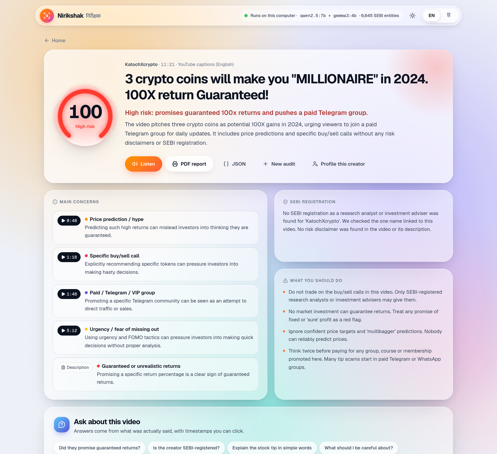
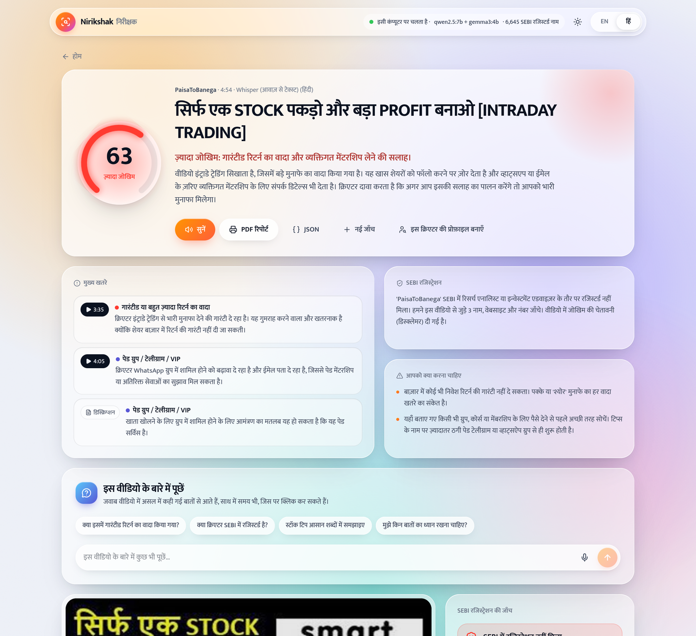
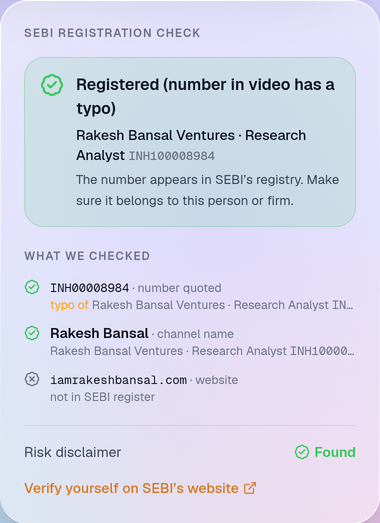
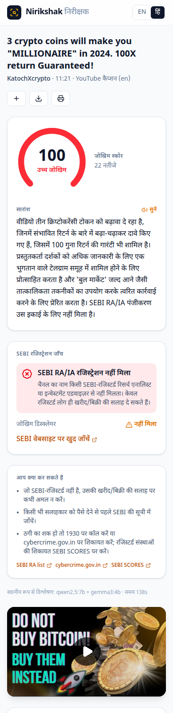
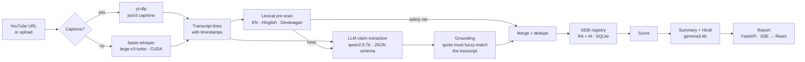

<div align="center">

# Nirikshak · निरीक्षक

**A local-first AI auditor for finance videos, forwarded "tips" and the creators behind them.**

- **Audit a video:** paste a YouTube link (or upload a video or voice note). Nirikshak finds guaranteed-return
  promises, buy/sell calls, hype, FOMO and hidden paid promotions, with timestamps.
- **Check a WhatsApp message:** paste a forwarded tip or drop a screenshot. It flags OTP requests, fake KYC
  alerts, payment demands, suspicious links and fake regulators.
- **Profile a creator:** audit a channel's recent videos and see how often they give tips or promise returns.
- **Ask questions:** chat with any audited video or message in English or Hindi, with clickable evidence.

Everyone and every number is checked against **SEBI's public registers** (6,600+ entities), and everything is
explained in English or Hindi, with a natural voice.

No cloud AI is used, no API keys are needed and no data leaves your machine.

**Live demo:** https://nirikshak-app.duckdns.org (hosted on AWS; this public version uses cloud AI, see [below](#hosted-demo)).



</div>

---

## Why

India now has more than 10 crore demat accounts, and many first-time investors learn about markets from
YouTube and Instagram "finfluencers". SEBI's 2024 rules bar registered entities from associating with
unregistered advisers, but the videos are still out there. A viewer in a Tier-2 town has no easy way to tell
education apart from an unregistered buy/sell call dressed up as education.

Nirikshak works like a second pair of eyes. It does **not** say whether a stock is good or bad. It audits
**what is being said** and **who is saying it**.

Built for **SANGYAN 2026** (SNTC IIT (BHU) × SEBI × NSDL), Track E: *Misinformation & Content Literacy*.

## What it does

| | |
|---|---|
| 🎯 **Timestamped claims** | Every flagged statement is quoted word-for-word with its timestamp. Clicking it jumps the embedded player to that moment. |
| 🏷️ **8 harm categories** | Guaranteed returns · specific buy/sell calls · price predictions · urgency/FOMO · paid promotion/affiliate · paid Telegram/VIP groups · SEBI-registration claims · misleading/cherry-picked claims |
| 🏛️ **Real SEBI registry check** | Mirrors 5 of SEBI's public registers (6,600+ entities: research analysts, investment advisers, portfolio managers, stock brokers, mutual funds). Checks every registration number quoted, the channel name, people the AI finds presenting or appearing as guest experts, and the creator's own website. Shows exactly what was checked. |
| 🧾 **Disclaimer check** | Detects whether a risk disclaimer exists ("not SEBI registered", "for educational purposes", "subject to market risks", including Hindi variants). |
| 🇮🇳 **Bharat-first** | Handles Hindi, English and Hinglish audio and captions. The UI, explanations and summaries are bilingual. |
| 🔊 **Natural read-aloud** | The summary is spoken by a local neural voice (Kokoro-82M) in English or Hindi, for users who find reading hard. |
| 📝 **Structured brief** | A verdict, an overview of what the video pitches, the top concerns with timestamps, SEBI status and concrete next steps. |
| 🖨️ **PDF report** | A complete A4 report: video details, summary, registry check, every finding with timestamp links, methodology, and the full transcript as an appendix. |
| 🎙️ **Voice notes too** | Upload a forwarded WhatsApp voice note or video. Whisper transcribes it on your GPU. |
| 📊 **Risk score** | A 0–100 score, built so that one repeated phrase can't dominate but several different kinds of red flag add up. |
| 💬 **Ask the video** | Chat about any audited video or message, typed or spoken (Hindi/English). Answers cite the exact moments; buy/sell or "will it go up?" questions are refused and redirected to the facts and registration status. |
| 📱 **WhatsApp tip checker** | Paste a forwarded message or drop a screenshot (read by a local vision model). Flags OTP/PIN requests, APKs and short links, UPI payment demands, fake KYC alerts and impersonation, e.g. a message using Zerodha's name but linking to `zerodha-kyc-update.in`. |
| 👤 **Creator trust profile** | Audits a channel's latest uploads (reusing existing audits) and shows how often each red flag appears, risk across videos, the worst moments and registration status. |
| 🔒 **Private by design** | Everything runs locally. Only YouTube and SEBI's public website are contacted. |

## Screenshots

| Hindi report (Whisper transcript) | SEBI check: typo'd number resolved to the creator's own registration |
|---|---|
|  |  |

| Home | Mobile (Hindi) |
|---|---|
|  |  |

## How it works



The design choices that matter:

- **Grounding against hallucination.** The LLM must return a verbatim quote and a line number. Any claim whose
  quote doesn't fuzzy-match the transcript (`rapidfuzz.partial_ratio ≥ 70`, also checked against neighbouring
  lines) is thrown away. The UI always shows the quote, so users can check it themselves.
- **Rules and LLM working together.** A fast multilingual regex layer
  ([`rules.py`](backend/nirikshak/rules.py)) sends the LLM *hints* about where to look, and acts as a
  low-confidence safety net when the LLM misses something. The LLM handles context: it doesn't flag a video that
  *warns* about guaranteed returns.
- **Constrained decoding.** Ollama's JSON-schema `format` forces output that always parses, with an enum of
  valid categories.
- **Two models, each used for what it does best.** `qwen2.5:7b` extracts the claims. `gemma3:4b` writes the
  Hindi, which is far more natural than Qwen's. Both fit a 6 GB laptop GPU because they run one after the other.
- **Captions first, Whisper when it matters.** When captions exist, speech-to-text is skipped. Whisper runs for
  uploads, videos without captions, or on demand (`--whisper`). It is worth it for Hindi: on a test video, YouTube's
  auto-captions garbled a *"मैं personal guarantee देता हूं"* ("I personally guarantee") claim that Whisper
  transcribed cleanly, so it was flagged. On the RTX 4050, Whisper transcribes 5 minutes of audio in about 25 s.
  The CUDA libraries come from pip wheels, so no system CUDA install is needed.
- **A summary that can't overstate the findings.** The LLM writes only the headline and the overview of what the
  video is about. The concerns, registration status and advice are assembled from verified findings and the
  registry check ([`summary.py`](backend/nirikshak/summary.py)).
- **A voice chosen by measurement.** Browsers on Linux fall back to espeak, which is hard to understand. Candidate
  voices were scored on intelligibility (Whisper character error rate) and predicted naturalness (UTMOS, 1–5):

  | Voice | English CER / UTMOS | Hindi CER / UTMOS |
  |---|---|---|
  | espeak-ng (browser fallback) | 0.05 / 1.61 | 0.27 / 1.38 |
  | Piper (best: amy / priyamvada) | 0.05 / 4.46 | 0.14 / 3.36 |
  | **Kokoro-82M** (af_heart / hf_alpha) | **0.05 / 4.53** | 0.14 / **4.03** |
  | **Kokoro + Devanagari normalisation** (shipped) | | **0.04 / 4.13** |

  Converting Latin words such as "SEBI" or "Telegram" to Devanagari before speaking stops the phonemizer from
  switching language mid-sentence, which cut Hindi errors by more than two thirds. Audio is generated on the CPU,
  cached as AAC, and pre-generated right after each audit.
- **Hindi people actually speak.** Hindi text follows one style guide and glossary
  ([`hindi.py`](backend/nirikshak/hindi.py)): everyday Hindi, common finance words kept as loanwords
  (रिटर्न, ग्रुप, टिप), short sentences. Without it the translation model produced textbook calques
  ("भुगतान किए गए समूह" for "paid group"). On 39 real report sentences, the style guide cut such stiff words
  from 4.75 to 0.28 per 100 words ([`eval/translate_eval.py`](backend/eval/translate_eval.py)).
- **Finding the registration behind a video.** The channel name is often not the registered name, so
  [`identity.py`](backend/nirikshak/identity.py) checks several identities:
  1. every registration number in any SEBI format (`INH`, `INA`, `INZ`, `INP`, …; grouped digits allowed);
  2. the channel name;
  3. owners, presenters and guest experts the LLM extracts from the description and transcript (each must appear
     verbatim, or it is dropped);
  4. the creator's own website, matched against the e-mail and web domains SEBI lists. Only domains that resemble the
     creator's name count, so an affiliate link to a broker doesn't make the creator "a broker".

  The verdict separates *registered adviser/analyst*, *registered only as a broker/PMS/fund* (not allowed to give
  tips), *guest expert registered*, and *not found*. On the saved test videos this turned five generic "not found"
  results into specific answers: Zerodha → registered stock broker; Evening Investors → guest Sandip Sabharwal is a
  registered research analyst. For privacy only the e-mail *domain* of registered entities is stored.
- **Registry matching that resists typos.** Creators often mistype their own registration numbers. A quoted number
  that isn't in the registry is matched to registered numbers within 2 edits, but only accepted if it resolves to
  the channel's own registered name, because one typo can be close to several real registrations.
- **SEBI registry mirror.** [`sebi.py`](backend/nirikshak/sebi.py) pages through SEBI's public intermediary
  pages, about one request per second, and stores the result in SQLite. A CSV snapshot ships with the repo.
  Unknown numbers fall back to a single live lookup.

## Evaluation

Claim detection is measured on hand-labelled transcript snippets in Hindi, English and Hinglish
([`backend/eval`](backend/eval)). Each snippet is labelled with the set of categories it should trigger. Six
"clean" snippets (pure education, market news, and warnings *about* scams) should trigger nothing.

- `cases.jsonl` (18 snippets): the **dev set**, used while writing prompts and rules.
- `heldout.jsonl` (12 snippets): written before any tuning and **never used to tune**.

**Held-out set** (the honest number):

| System | Precision | Recall | F1 | False alarms on clean snippets | s / snippet* |
|---|---|---|---|---|---|
| Keyword rules only | 1.00 | 0.38 | 0.56 | 0 / 4 | <0.01 |
| gemma3:4b + rules | 0.69 | 0.69 | 0.69 | 2 / 4 | 2.8 |
| qwen3:8b + rules | 0.73 | 0.85 | 0.79 | 0 / 4 | 12.4 |
| **qwen2.5:7b + rules** (shipped) | **0.92** | **0.92** | **0.92** | **0 / 4** | 7.0† |

Dev set, for reference: rules 0.84 F1 · gemma3:4b 0.78 · qwen3:8b 0.88 · **qwen2.5:7b 0.90**.
Qwen 2.5 had the fewest false alarms on clean snippets (1/6, against 3/6 and 4/6 for the other models).

\*RTX 4050 Laptop (6 GB). qwen3:8b doesn't fit fully in 6 GB of VRAM and partly runs on the CPU, which explains
its latency. †Last re-run happened while read-aloud audio was being generated on the CPU; unloaded it was 4.5 s. Raw numbers are in [`backend/eval/results.json`](backend/eval/results.json).

### Forwarded-message checker

Same method on WhatsApp/Telegram/SMS-style messages ([`messages.jsonl`](backend/eval/messages.jsonl) dev set
of 16, [`messages_heldout.jsonl`](backend/eval/messages_heldout.jsonl) of 10 written before tuning). Clean
messages include a family chat, a genuine bank OTP SMS, market news and a real broker notice.

| System | Dev F1 | **Held-out** P / R / **F1** | False alarms on clean (held-out) |
|---|---|---|---|
| Keyword rules only | 0.84 | 1.00 / 0.62 / 0.76 | 0 / 4 |
| **qwen2.5:7b + rules + domain check** | 0.88 | **1.00 / 0.92 / 0.96** | **0 / 4** |

The one remaining dev-set false alarm is a news line mentioning the RBI, flagged as impersonation.

### Ask the video

Checked by hand on 12 questions across 4 real reports (English and Hindi videos). After fixes, all factual
questions were answered with correct, clickable evidence (e.g. the "*I can guarantee it can reach 10 cents*"
moment at 6:59), the two "should I buy / will it double" questions were refused, and concept questions
("what is a stop-loss?") got labelled general explanations. Typical answer time is 10–20 s on the RTX 4050.

The rules-only baseline is precise but misses most real claims on unseen phrasing. The LLM layer is what
generalises. The sets are small and written by the author, so treat the numbers as a sanity check, not a
benchmark. More real labelled data is the most useful next step.

```bash
cd backend
uv run python eval/eval.py --set heldout            # shipped pipeline
uv run python eval/eval.py --set heldout --rules-only
NIRIKSHAK_LLM=gemma3:4b uv run python eval/eval.py  # try another model
```

## Run it

**Requirements:** Python 3.12 (managed by [uv](https://docs.astral.sh/uv/)), Node 20+, ffmpeg,
[Ollama](https://ollama.com). An NVIDIA GPU with at least 6 GB is recommended; it also works on CPU, just slowly.

```bash
git clone https://github.com/RudraPandit0504/nirikshak.git
cd nirikshak

ollama pull qwen2.5:7b
ollama pull gemma3:4b

cd frontend && npm ci && npm run build && cd ..
cd backend && uv sync
uv run nirikshak serve            # → http://127.0.0.1:8000
```

CLI:

```bash
uv run nirikshak audit "https://www.youtube.com/watch?v=…"   # prints a report
uv run nirikshak audit voice_note.opus -o report.json        # local file → Whisper
uv run nirikshak sebi-sync                                   # refresh SEBI registry (~3 min)
uv run nirikshak profile https://www.youtube.com/@channel -n 8   # creator trust profile
uv run nirikshak resummarize [--retranslate] [--recheck]     # rebuild summaries / Hindi / SEBI check of saved reports
uv run pytest                                                # unit tests (no GPU/network)
```

Docker (needs the NVIDIA Container Toolkit for GPU):

```bash
docker compose up --build        # pulls models on first run, then serves on :8000
```

The image builds, but the full GPU compose stack has not been tested end-to-end yet; the native setup above is the tested path.

### Hosted demo

The public demo runs the same code with `NIRIKSHAK_PROVIDER=cloud`: AI calls go to Amazon Bedrock
(`gpt-oss-120b`), falling back to Groq and then Google Gemini, with keys kept server-side and a per-visitor
hourly limit. It runs on one EC2 instance behind Caddy for HTTPS; see [deploy/AWS_DEPLOY.md](deploy/AWS_DEPLOY.md).
Cloud mode is less consistent than the local models on video audits (held-out F1 0.74–0.93 depending on which
model answers, vs 0.92 locally) and matches them on forwarded messages (0.96).

For frontend development, run `npm run dev` in `frontend/`; it proxies `/api` to `:8000`.

Configuration is through environment variables: `NIRIKSHAK_LLM`, `NIRIKSHAK_LLM_HI`, `NIRIKSHAK_WHISPER`,
`NIRIKSHAK_TTS_EN`, `NIRIKSHAK_TTS_HI`, `OLLAMA_URL`, `NIRIKSHAK_MAX_DURATION`. The voice model (about 350 MB)
downloads on first use.

## Project layout

```
backend/nirikshak/
  ingest.py       yt-dlp metadata + caption selection (prefers captions in the spoken language)
  transcribe.py   faster-whisper on CUDA, frees VRAM afterwards
  rules.py        multilingual lexical rules, disclaimer + registration-number detection
  analyse.py      windowing, LLM extraction, grounding, merge, summary, Hindi translation
  sebi.py         SEBI register mirror (5 lists), number / name / domain lookup
  identity.py     who is behind a video: numbers, names, guests, websites → verdict; impersonation check
  qa.py           Ask the video: question planning, BM25 retrieval, grounded answers, advice refusal
  profile.py      creator trust profile: recent uploads → aggregated pattern
  pipeline.py     orchestration, registry verdict, scoring
  summary.py      structured brief (headline/overview by LLM, the rest from findings)
  tts.py          Kokoro read-aloud, speech-text normalisation, audio cache
  api.py          FastAPI: jobs, SSE progress, reports, static frontend
backend/eval/     labelled dev + held-out sets, eval script, results.json
backend/tests/    unit tests
frontend/src/     React + TypeScript + Tailwind UI
```

## Guardrails

- It never gives stock tips, price predictions or buy/sell/hold opinions, and it doesn't promote any broker or product.
- It audits *content*, not people. A name match against the registry is shown as "possible match: verify the
  number", never as proof.
- It is honest about uncertainty: every finding carries a confidence score, weak signals are hidden by default,
  and every claim links to the exact moment in the video so the viewer can judge it themselves.
- It collects no personal data. Uploads are deleted once processing ends, and reports are stored only on the local machine.

## Limitations and next steps

- YouTube auto-captions for Hindi are noisy. Whisper is more accurate but slower, and `--whisper` forces it.
- Name matches can collide (two people with the same name), so the UI asks users to confirm the number on SEBI's
  site. AMFI-registered mutual-fund distributors (ARN) aren't covered yet.
- Next: a browser extension that shows the audit on YouTube itself; Instagram Reels support; Tamil, Telugu,
  Bengali and Marathi output via IndicTrans2; a larger labelled dataset built with volunteers.

## Disclaimer

Nirikshak is an awareness tool. It is not investment advice and it can make mistakes. Verify any adviser on
[SEBI's website](https://www.sebi.gov.in/sebiweb/other/OtherAction.do?doRecognisedFpi=yes&intmId=14). To report
fraud, call **1930** or visit [cybercrime.gov.in](https://cybercrime.gov.in).

## License

MIT
